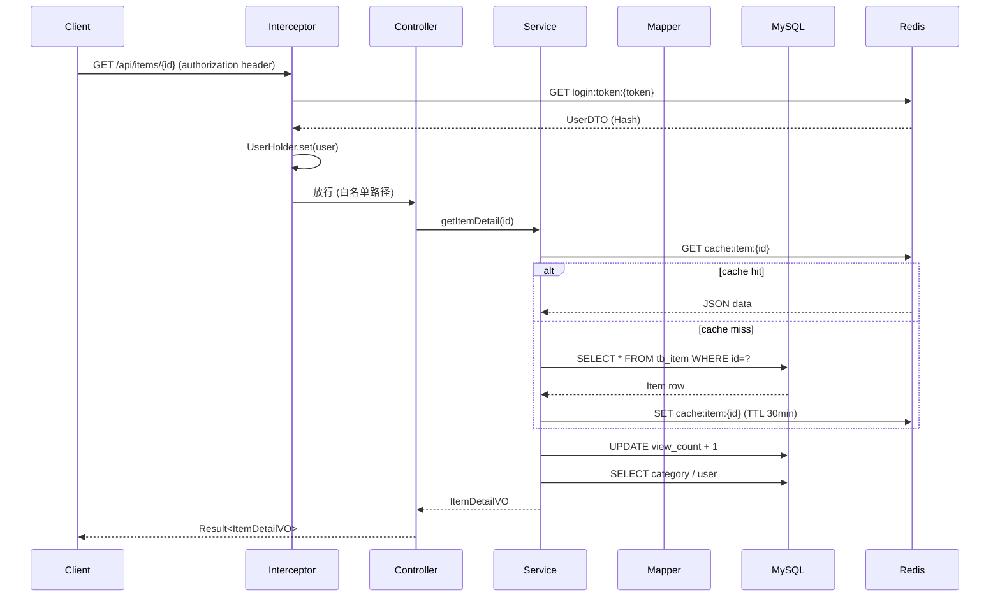
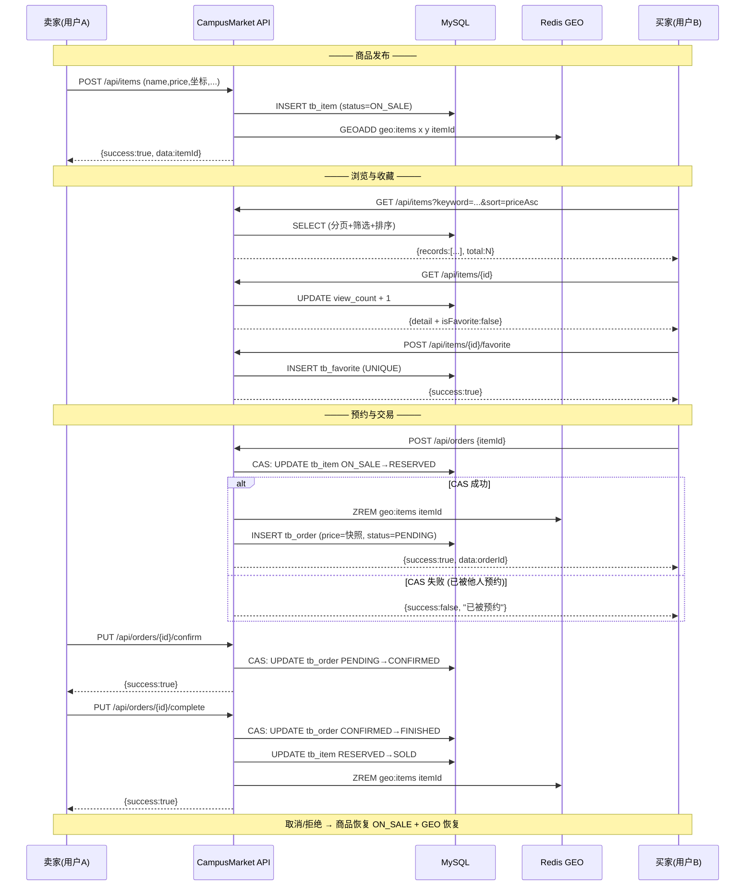

<p align="center">
  <h1 align="center">Campus Market</h1>
  <p align="center"><strong>校园二手交易平台</strong> — Spring Boot + MyBatis-Plus + Redis 后端项目</p>
</p>

<p align="center">
  
  
  
  
  
  
  
  
  
  
</p>

---

## 项目简介

Campus Market 是一个**校园二手交易平台**的完整后端服务，基于 Spring Boot + MyBatis-Plus + Redis 构建。

学生在校园内**发布闲置物品** → **浏览/搜索/筛选** → **收藏** → **预约** → **线下交易**。整个流程涵盖商品生命周期管理、Redis GEO 地理位置搜索、并发安全的订单状态机。

### 业务背景

校园二手交易是高频刚需场景（毕业季、开学季）。学生自发的 QQ 群/微信群存在三大痛点：

| 痛点 | 本项目方案 |
|------|-----------|
| 信息散乱，搜索困难 | 结构化发布 + 分类/关键字/价格筛选 |
| 信任缺失，交易无保障 | 订单状态可追溯 + 价格快照存档 |
| 地理位置不透明 | Redis GEO 附近商品搜索 |

### 项目特点

- **8 个 Sprint 完整交付**，从数据模型到 GEO 附近商品，通过 68 项企业级验收
- **CAS 乐观并发控制** — 所有订单状态流转无锁化，数据库行级锁保证正确性
- **Redis GEO 空间索引** — 附近商品搜索，增删改查+订单 6 节点全生命周期同步
- **Cache-Aside 缓存** — 旁路缓存 + 空值防穿透，CacheClient 统一封装
- **并发集成测试** — JUnit 5 + CountDownLatch + TestRestTemplate 真实并发验收
- **企业级规范** — 统一 Result、@Valid 参数校验、PublicUrls 白名单鉴权

---

## 项目预览

> 截图占位 — 后续补充实际运行截图。建议使用 ApiPost / Postman 截图 + IDEA 控制台截图 + 数据库截图。

| 首页 · 商品列表 | 商品详情 | 发布商品 |
|:---:|:---:|:---:|
|  |  |  |

| 我的收藏 | 订单管理 | 附近商品 (GEO) |
|:---:|:---:|:---:|
|  |  |  |

| 系统架构 | 数据库 ER 图 | 验收测试报告 |
|:---:|:---:|:---:|
|  |  |  |

---

## 技术栈

| 分层 | 技术 | 版本 | 说明 |
|------|------|------|------|
| 语言 | Java | 21 LTS | 长期支持版本 |
| 框架 | Spring Boot | 2.3.12.RELEASE | 内嵌 Tomcat 9 |
| ORM | MyBatis-Plus | 3.4.3 | Lambda 查询 + 分页插件 |
| 数据库 | MySQL | 8.0 | HikariCP 连接池 |
| 缓存 | Redis | 6.2+ | Lettuce 客户端 + Redisson 3.13.6 |
| 工具 | Hutool, Lombok | — | 通用工具 + 代码简化 |
| 校验 | Jakarta Validation | — | @Valid + DTO 字段注解 |
| 并发测试 | JUnit 5 | 5.x | CountDownLatch + TestRestTemplate |
| 构建 | Maven | 3.x | 单模块构建 |

---

## 系统架构

### 分层架构图

```
┌──────────────────────────────────────────────────────────────────┐
│                         Client (Browser / App)                    │
└──────────────────────────────┬───────────────────────────────────┘
                               │  HTTP :8081
                               ▼
┌──────────────────────────────────────────────────────────────────┐
│                    Spring Boot Application                        │
│                                                                   │
│  ┌─────────────────────────────────────────────────────────────┐ │
│  │                   Interceptor Chain                          │ │
│  │  RefreshTokenInterceptor (order=0) → ThreadLocal(UserDTO)   │ │
│  │  LoginInterceptor (order=1) → 401 if not in PublicUrls     │ │
│  └────────────────────────────┬────────────────────────────────┘ │
│                               ▼                                   │
│  ┌─────────────────────────────────────────────────────────────┐ │
│  │                      Controller Layer                        │ │
│  │  ┌──────────────┐ ┌──────────────┐ ┌──────────────────────┐ │ │
│  │  │ ItemController│ │OrderController│ │FavoriteController   │ │ │
│  │  │ GET/POST/PUT  │ │ POST/GET/PUT  │ │ POST/DELETE/GET      │ │ │
│  │  │ /DELETE       │ │ /buyer/seller │ │                      │ │ │
│  │  └──────┬───────┘ └──────┬───────┘ └──────────┬───────────┘ │ │
│  └─────────┼────────────────┼────────────────────┼─────────────┘ │
│            ▼                ▼                    ▼               │
│  ┌─────────────────────────────────────────────────────────────┐ │
│  │                       Service Layer                          │ │
│  │  ┌──────────────┐ ┌──────────────┐ ┌──────────────────────┐ │ │
│  │  │ItemServiceImpl│ │OrderServiceImpl│ │FavoriteServiceImpl  │ │ │
│  │  │ · Cache-Aside │ │ · CAS 状态机   │ │ · 幂等 + 静默过滤    │ │ │
│  │  │ · GEO 同步    │ │ · GEO 同步     │ │                      │ │ │
│  │  │ · @Valid 校验 │ │ · 价格快照     │ │                      │ │ │
│  │  └──────┬───────┘ └──────┬───────┘ └──────────┬───────────┘ │ │
│  └─────────┼────────────────┼────────────────────┼─────────────┘ │
│            ▼                ▼                    ▼               │
│  ┌─────────────────────────────────────────────────────────────┐ │
│  │                       Mapper Layer                           │ │
│  │  MyBatis-Plus BaseMapper<T> + LambdaQueryWrapper            │ │
│  │  · selectBatchIds (防 N+1)    · LambdaUpdateWrapper (CAS)  │ │
│  └────────────────────────────┬────────────────────────────────┘ │
└───────────────────────────────┼──────────────────────────────────┘
                                │
              ┌─────────────────┴─────────────────┐
              ▼                                   ▼
┌──────────────────────────┐     ┌──────────────────────────────┐
│        MySQL 8.0         │     │         Redis 6.2             │
│                          │     │                              │
│  tb_item    tb_order     │     │  cache:item:{id}  (String)   │
│  tb_favorite tb_category │     │  geo:items        (GEO)      │
│  tb_user    tb_credit_*  │     │  login:token:*    (Hash)     │
│                          │     │  login:code:*     (String)   │
└──────────────────────────┘     └──────────────────────────────┘
```

### 请求处理流程（Mermaid）



---

## 完整业务流程

用户 A（卖家）发布 → 用户 B（买家）浏览 → 收藏 → 预约 → 卖家确认 → 交易完成。



---

## Sprint 演进过程

| Sprint | 模块 | 核心交付 | DB 变更 | 状态 |
|:------:|------|----------|---------|:----:|
| S1 | 数据模型 | 6 个 Entity, 6 个 Enum, `campus_market.sql` | 6 张新表 | ✅ |
| S2 | Mapper 层 | 6 个 Mapper (BaseMapper) | — | ✅ |
| S3 | 分类模块 | `GET /api/categories`, CategoryVO | 种子数据 | ✅ |
| S4 | 商品发布 | 发布/修改/删除, @Valid 校验, 审核开关 | `tb_item` 投用 | ✅ |
| S5 | 商品浏览 | 分页/筛选/搜索/排序, Cache-Aside, 防穿透 | — | ✅ |
| S6 | 收藏 | 幂等收藏/取消, 静默过滤, isFavorite | `tb_favorite` 投用 | ✅ |
| S7 | 订单 | CAS 状态机, 价格快照, 5 种流转, GEO 联动 | `tb_order.price` 补列 | ✅ |
| S8 | GEO | 附近商品搜索, 全生命周期同步, 启动预热 | Redis GEO 投用 | ✅ |

**Sprint 1-3 概要：**

- **S1 (数据模型)** — 设计 6 张核心表：`tb_item`, `tb_category`, `tb_favorite`, `tb_order`, `tb_credit_record`, `tb_report`。关键决策：价格用 `bigint` 存"分"、Item 用逻辑删除、Favorite 建 UNIQUE 约束。
- **S2 (Mapper 层)** — 创建 6 个 Mapper 接口，全部继承 MyBatis-Plus `BaseMapper<T>`，零 SQL 手写。配置 `@MapperScan("com.campus.mapper")` 双包扫描。
- **S3 (分类模块)** — 实现 `GET /api/categories` 匿名接口 + `CategoryVO`。写入种子数据（手机数码/电脑办公/图书教材），并为后续 Item 模块的 `categoryId` 外键校验做好准备。

---

## 数据库设计

### ER 图

```
                    ┌──────────────────────────────────────┐
                    │             tb_category              │
                    │  id (PK)   name    icon    sort     │
                    └──────────────┬───────────────────────┘
                                   │ categoryId (FK)
                                   ▼
┌──────────────┐    ┌──────────────────────────────────────────────┐
│   tb_user    │    │                  tb_item                     │
│  id (PK)     │◄───┤ sellerId (FK)                               │
│  phone       │    │ id (PK)  name  images  description          │
│  nickName    │    │ price (分)  originalPrice                   │
│  icon        │    │ campus  meetPlace  x  y                     │
│  createTime  │    │ itemCondition (1-5)                         │
└──────────────┘    │ status (1=ON_SALE/2=RESERVED/3=SOLD/4=OFF)  │
       ▲            │ auditStatus (0=PENDING/1=APPROVED/2=REJECT) │
       │            │ deleted  viewCount  consultCount             │
       │            └──────┬───────────┬──────────────────────────┘
       │                   │           │ itemId (FK)
       │                   │           ▼
       │                   │  ┌────────────────────────┐
       │                   │  │      tb_favorite       │
       │                   │  │ userId (FK) ───────────┼──┐
       │                   │  │ itemId (FK)            │  │
       │                   │  │ UNIQUE(userId, itemId) │  │
       │                   │  └────────────────────────┘  │
       │                   │                              │
       │                   │  ┌────────────────────────┐  │
       │                   │  │       tb_order         │  │
       ├───────────────────┼──┤ sellerId (FK)          │  │
       ├───────────────────┼──┤ buyerId (FK)           │  │
       │                   │  │ itemId (FK)            │  │
       │                   │  │ price (下单快照, 分)    │  │
       │                   │  │ status (1=PENDING      │  │
       │                   │  │     2=CONFIRMED        │  │
       │                   │  │     3=FINISHED         │  │
       │                   │  │     4=REJECTED         │  │
       │                   │  │     5=CANCELLED)       │  │
       │                   │  └────────────────────────┘  │
       │                   └──────────────────────────────┘
       │
       │  ┌────────────────┐    ┌────────────────┐
       └──┤ tb_credit_record│    │   tb_report    │
          │ (预留, V2)     │    │ (预留, V2)     │
          └────────────────┘    └────────────────┘
```

### 设计决策

| 决策 | 方案 | 理由 |
|------|------|------|
| 价格存储 | `bigint` 存「分」 | 避免 `DECIMAL` 精度和 `FLOAT` 舍入问题 |
| 订单价格 | 下单时快照 `tb_order.price` | 商品后续调价不影响历史订单统计 |
| 商品删除 | 逻辑删除 (`deleted=0/1`) | 保留数据可追溯，订单关联不断裂 |
| 收藏幂等 | `UNIQUE(userId, itemId)` | 数据库层面保证，无需应用层加锁 |
| 状态机 | `UPDATE WHERE status=?` (CAS) | 乐观锁避免分布式锁开销 |

---

## Redis 设计

### Key 空间全景

```
Redis (127.0.0.1:6379)
│
├── login:code:138****8000     [String]  TTL=2min   验证码 "801512"
├── login:token:4a1935de...    [Hash]    TTL=10h    用户登录态 {id, nickName, icon}
│
├── cache:item:7               [String]  TTL=30min  商品详情JSON "{\"id\":7,\"name\":...}"
├── cache:item:7:null          [String]  TTL=2min   空值缓存 (防穿透) ""
│
└── geo:items                  [ZSet]    TTL=永久    GEO空间索引
    ├── member:"3" score:4069885544737889  (经纬度编码)
    ├── member:"9" score:4069885365545471
    └── ...
```

### Cache-Aside 旁路缓存

```
┌──────────────────────────────────────────────────────────┐
│                    读操作 (getItemDetail)                  │
│                                                          │
│   Client ──→ ① GET cache:item:{id} ──→ 命中 → 返回      │
│                │                                         │
│                │ 未命中                                   │
│                ▼                                         │
│            ② SELECT * FROM tb_item WHERE id=?            │
│                │                                         │
│          ┌────┴────┐                                     │
│          │ DB有数据  │         │ DB无数据                 │
│          ▼         ▼         ▼                          │
│    ③ SET cache   返回    ③ SET cache:item:{id}:null     │
│      TTL=30min               TTL=2min (防穿透)           │
└──────────────────────────────────────────────────────────┘

┌──────────────────────────────────────────────────────────┐
│                    写操作 (updateItem/deleteItem)         │
│                                                          │
│   Client ──→ ① UPDATE tb_item SET ... WHERE id=?        │
│            ② DEL cache:item:{id}                        │
│            (下次读时 Cache-Aside 自动重建)                 │
└──────────────────────────────────────────────────────────┘
```

### GEO 全生命周期同步

```
 Item CRUD                      Order 状态变更
 ─────────                      ─────────────
 CREATE → GEOADD                PENDING     → ZREM (下单即下架)
 UPDATE → GEOADD (覆盖坐标)      CANCELLED   → GEOADD (买家取消, 商品恢复)
 DELETE → ZREM                  REJECTED    → GEOADD (卖家拒绝, 商品恢复)
                                FINISHED    → ZREM (交易完成, 永久下架)

 启动时 → @EventListener(ApplicationReadyEvent) → 全量加载
          SELECT * FROM tb_item WHERE deleted=0 AND status=ON_SALE
          AND auditStatus=APPROVED AND x IS NOT NULL AND y IS NOT NULL
          → 批量 GEOADD geo:items
```

### 为什么收藏不用 Redis？

收藏是**持久化关系数据**，需要 MySQL UNIQUE KEY 保证幂等性。收藏查询简单（`SELECT * FROM tb_favorite WHERE userId=?`），数据量小，不需要缓存加速。V2 若收藏量很大，可引入 Redis Set 做快速成员判断，MySQL 做持久化。

---

## API 文档

### 完整接口列表（18 个 + 分类 1 个）

#### 分类

| Method | Path | 说明 | Auth | Sprint |
|:------:|------|------|:----:|:------:|
| GET | `/api/categories` | 分类列表 | — | S3 |

#### 商品

| Method | Path | 说明 | Auth | Sprint |
|:------:|------|------|:----:|:------:|
| GET | `/api/items` | 列表 (分页/筛选/搜索/排序) | — | S5 |
| GET | `/api/items/nearby` | 附近商品 (GEO) | — | S8 |
| GET | `/api/items/{id}` | 详情 (缓存+isFavorite) | — | S5 |
| POST | `/api/items` | 发布商品 | ✓ | S4 |
| PUT | `/api/items/{id}` | 修改商品 | ✓ | S4 |
| DELETE | `/api/items/{id}` | 逻辑删除 | ✓ | S4 |

#### 收藏

| Method | Path | 说明 | Auth | Sprint |
|:------:|------|------|:----:|:------:|
| POST | `/api/items/{id}/favorite` | 收藏 (幂等) | ✓ | S6 |
| DELETE | `/api/items/{id}/favorite` | 取消收藏 (幂等) | ✓ | S6 |
| GET | `/api/users/me/favorites` | 我的收藏 (静默过滤) | ✓ | S6 |

#### 订单

| Method | Path | 说明 | Auth | Sprint |
|:------:|------|------|:----:|:------:|
| POST | `/api/orders` | 创建订单 (CAS+快照) | ✓ | S7 |
| GET | `/api/orders/buyer` | 我买的 (分页) | ✓ | S7 |
| GET | `/api/orders/seller` | 我卖的 (分页) | ✓ | S7 |
| GET | `/api/orders/{id}` | 订单详情 | ✓ | S7 |
| PUT | `/api/orders/{id}/confirm` | 卖家确认 (CAS) | ✓ | S7 |
| PUT | `/api/orders/{id}/reject` | 卖家拒绝 (CAS+恢复) | ✓ | S7 |
| PUT | `/api/orders/{id}/cancel` | 买家取消 (CAS+恢复) | ✓ | S7 |
| PUT | `/api/orders/{id}/complete` | 卖家完成 (CAS) | ✓ | S7 |

### 鉴权模型

```
Request
  │
  ▼
RefreshTokenInterceptor (order=0, /**)
  │ 提取 authorization header → Redis Hash 查登录态 → UserHolder.set(user)
  │ 未登录用户 → UserHolder 为空
  ▼
LoginInterceptor (order=1, exclude=PublicUrls)
  │ 白名单路径 → 直接放行
  │ 非白名单 + UserHolder 为空 → 401
  ▼
Controller
  │ 白名单内的写接口 (如 POST /api/items) 手动检查 UserHolder.getUser()
```

**PublicUrls 白名单：** `/api/categories/**`, `/api/items/**`, `/api/hot-items/**`, `/shop/**`, `/voucher/**`, `/shop-type/**`, `/upload/**`, `/blog/hot`, `/user/code`, `/user/login`

---

## 快速启动

### 环境要求

| 软件 | 版本 | 端口 | 安装方式 |
|------|------|------|---------|
| JDK | 21 | — | [Adoptium](https://adoptium.net/) |
| MySQL | 8.0+ | 3306 | 本地安装 或 Docker |
| Redis | 6.2+ | 6379 | `docker run -d --name redis -p 6379:6379 redis:7 --requirepass 123321` |
| Maven | 3.6+ | — | IDEA 内置 或 [下载](https://maven.apache.org/) |
| IDEA | 2023+ | — | IntelliJ IDEA |

### 从零到运行（8 步）

```bash
# 1. 克隆项目
git clone <repo-url> && cd heimadianping/hm-dianping

# 2. 导入数据库
mysql -u root -p < src/main/resources/db/legacy_data.sql
mysql -u root -p < src/main/resources/db/campus_market.sql

# 3. 启动 Redis (Docker)
docker run -d --name redis -p 6379:6379 redis:7 --requirepass 123321

# 4. 修改配置 (可选)
# 编辑 src/main/resources/application.yaml

# 5. IDEA 配置 VM Options:
#    Run → Edit Configurations → HmDianPingApplication → VM options
#    --add-opens java.base/java.lang.invoke=ALL-UNNAMED
#    --add-opens java.base/java.lang.reflect=ALL-UNNAMED

# 6. 运行 HmDianPingApplication.main()

# 7. 验证
curl http://localhost:8081/api/categories
# → {"success":true,"data":[...]}

# 8. 登录测试
curl -X POST "http://localhost:8081/user/code?phone=13800138000"
# IDEA 控制台找验证码 →
curl -X POST http://localhost:8081/user/login \
  -H "Content-Type: application/json" \
  -d '{"phone":"13800138000","code":"XXXXXX"}'
# → {"success":true,"data":"<token>"}

curl http://localhost:8081/api/items \
  -H "authorization: <token>"
```

---

## Docker 部署

### 一键启动

```bash
# 1. 进入项目根目录
cd heimadianping

# 2. 编译项目 (生成 JAR)
cd hm-dianping && mvn package -DskipTests && cd ..

# 3. (可选) 修改环境变量
cp .env.example .env

# 4. 构建 + 启动 (首次构建约 1-2 分钟)
docker compose up -d --build

# 5. 等待健康检查通过
docker compose ps
# 三个服务 STATUS 均为 healthy / Up

# 6. 验证
curl http://localhost:8081/api/categories
# → {"success":true,"data":[...]}
```

### 服务架构

```
docker compose.yml
├── mysql (3306)    ← 启动时自动执行 legacy_data.sql + campus_market.sql
├── redis (6379)    ← AOF 持久化, 密码认证
└── app   (8081)    ← Spring Boot, 等待 MySQL + Redis healthy 后启动
```

### 端口映射

| 服务 | 宿主机 | 容器 | 说明 |
|------|:------:|:----:|------|
| MySQL | 3306 | 3306 | 本地 MySQL 客户端可直接连接 |
| Redis | 6379 | 6379 | 本地 redis-cli 可直接连接 |
| App | 8081 | 8081 | 通过 `${APP_PORT}` 可自定义 |

### 环境变量

| 变量 | 默认值 | 说明 |
|------|--------|------|
| `MYSQL_ROOT_PASSWORD` | `123456` | MySQL root 密码 |
| `MYSQL_DATABASE` | `hmdp` | 数据库名 |
| `REDIS_PASSWORD` | `123321` | Redis 密码 |
| `APP_PORT` | `8081` | 应用端口 |

### 常用命令

```bash
# 查看日志
docker compose logs -f app

# 重启单服务
docker compose restart app

# 停止并清理 (保留数据卷)
docker compose down

# 停止并清理数据 (完全重置)
docker compose down -v

# 重新构建 App 镜像 (代码变更后)
docker compose up -d --build app
```

### 数据持久化

| Volume | 用途 | 清空命令 |
|--------|------|---------|
| `mysql-data` | MySQL 数据文件 | `docker compose down -v` |
| `redis-data` | Redis AOF 快照 | `docker compose down -v` |

数据库初始化 SQL 位于 `hm-dianping/src/main/resources/db/`，初次启动时自动执行，后续重启不会重复执行。

---

## 验收测试报告

### Backend Acceptance Summary

**日期：** 2026-07-12 | **QA：** Claude (Tech Lead) | **结论：** Production Ready

| Phase | 模块 | 用例数 | PASS | FAIL | 通过率 |
|:-----:|------|:------:|:----:|:----:|:------:|
| 2 | Category | 3 | 3 | 0 | 100% |
| 3 | Item (CRUD/浏览/校验) | 18 | 18 | 0 | 100% |
| 4 | Favorite (收藏) | 8 | 8 | 0 | 100% |
| 5 | Order (订单/CAS) | 16 | 16 | 0 | 100% |
| 6 | GEO (附近商品) | 10 | 10 | 0 | 100% |
| 7 | Regression (全链路回归) | 2 | 2 | 0 | 100% |
| 8 | Concurrency (JUnit 并发) | 4 | 4 | 0 | 100% |
| 8 | Stress & Boundary | 6 | 6 | 0 | 100% |
| 8 | Data Consistency | 1 | 1 | 0 | 100% |
| **合计** | | **68** | **68** | **0** | **100%** |

### 关键验证结果

| 测试场景 | 方法 | 结果 |
|---------|------|:---:|
| 两个买家同时预约同一商品 | CountDownLatch + 2 线程 | ✅ 仅 1 人成功 |
| Seller confirm vs Buyer cancel 并发 | CountDownLatch + 2 线程 | ✅ 仅 1 个状态变更 |
| 并发重复收藏 | CountDownLatch + 2 线程 | ✅ UNIQUE KEY 保护 |
| 并发重复取消收藏 | CountDownLatch + 2 线程 | ✅ 幂等无报错 |
| 缓存删除后自动重建 | 手动 DEL key → 再次请求 | ✅ 从 DB 恢复 |
| GEO 启动预热 | DEL geo:items → 重启应用 | ✅ 全量从 DB 加载 |
| 数据一致性 | SQL 检查孤儿订单/孤立状态 | ✅ 零脏数据 |
| SQL 注入防护 | keyword=`' OR '1'='1` | ✅ MyBatis-Plus 参数化 |

### 已知技术债务（非阻塞）

| ID | 描述 | 影响 | 计划 |
|----|------|------|------|
| TD-1 | JDK 21 + MP 3.4.3 需额外 JVM 参数 | 低 | 升级 MP 至 3.5.x |
| TD-9 | 缓存删除失败无重试机制 | 低 | V2 引入 MQ 或延迟双删 |
| TD-10 | pageFavorites.total 含已失效 | 低 | V2 优化计数逻辑 |

---

## 项目亮点

### 关键技术决策

| 决策点 | 选择 | 对比方案 | 选择理由 |
|--------|------|---------|---------|
| 并发控制 | **CAS 乐观锁** (`UPDATE WHERE status=?`) | 悲观锁 (SELECT FOR UPDATE) / Redisson 分布式锁 | 无需额外锁开销，利用 DB 行级锁，代码简洁 |
| 价格存储 | **bigint 存「分」** | DECIMAL / FLOAT | 无浮点舍入误差，整数运算比 DECIMAL 快 |
| 订单价格 | **下单时快照** | 关联实时查询商品价格 | 商品调价后历史订单不受影响，审计可追溯 |
| 地理位置 | **Redis GEO** (ZSet 底层) | MySQL 空间索引 (SPATIAL) | Redis 内存计算毫秒级响应，与缓存统一技术栈 |
| 缓存模式 | **Cache-Aside** | Read/Write-Through | 实现简单，缓存失效风险可控，应用层控制粒度 |
| 收藏幂等 | **DB UNIQUE 约束** | 应用层 SELECT-before-INSERT | 原子性保证，无竞态条件，代码更简单 |
| 双包架构 | **@ComponentScan + @MapperScan** | 模块拆分多项目 | 单 JVM 部署简单，旧代码完整保留 |

### 面试 / 简历要点

**1. CAS 乐观并发控制**

全部订单状态流转采用 `UPDATE WHERE status=?` 模式，无锁化保证并发安全。JUnit 5 + CountDownLatch 并发测试验证通过。是《高性能 MySQL》推荐的并发模式。

**2. Redis GEO 空间索引**

GEOADD / GEOSEARCH / ZREM 完整覆盖 6 个生命周期节点。即使 Redis 重启，`@EventListener(ApplicationReadyEvent)` 从 DB 全量预热恢复。

**3. 订单状态机**

5 种状态 (PENDING → CONFIRMED → FINISHED / REJECTED / CANCELLED)，每种流转带 CAS 条件 + affectedRows 检查。取消/拒绝时自动恢复商品 ON_SALE 并还原 GEO。

**4. Cache-Aside + 防穿透**

统一 CacheClient 封装：Redis miss → DB → 写缓存 (TTL 30min)。空值缓存 (TTL 2min) 预防恶意穿透。企业级旁路缓存模式。

**5. 批量查询防 N+1**

所有列表接口使用 `selectBatchIds` 一次性批量加载关联数据（分类名、卖家昵称），避免 O(N) 次查询。

**6. 双包渐进式重构**

新旧代码零冲突共存于同一 JVM，`com.campus` 逐步替代 `com.hmdp`。适合在遗留系统上做技术演进。

---

## V2 Roadmap

| 优先级 | 功能 | 技术选型 |
|:------:|------|---------|
| P0 | Docker 一键部署 | Docker Compose |
| P0 | 单元测试全覆盖 | JUnit 5 + Mockito |
| P1 | 图片上传 | 阿里云 OSS / MinIO |
| P1 | 商品热度排行榜 | Redis ZSet (浏览量+收藏加权) |
| P1 | 信誉分体系 | 事件驱动 + 汇总快照 (已设计) |
| P1 | API 文档 | Knife4j / SpringDoc |
| P2 | IM 在线咨询 | WebSocket / STOMP |
| P2 | 关注 Feed 流 | Redis ZSet Push 模式 |
| P2 | 限时抢购 | Lua 脚本 + Redis Stream |
| P3 | ES 全文搜索 | Elasticsearch 替换 MySQL LIKE |
| P3 | 管理后台 | Vue 3 / React + Ant Design |

---

## 项目结构

```
heimadianping/
├── README.md
├── docs/
│   ├── Project-Final-Review-v1.md         ← 最终架构评审
│   ├── Backend-Acceptance-Test-Plan.md    ← 验收测试计划
│   └── screenshots/                       ← 截图目录
└── hm-dianping/
    ├── pom.xml
    ├── src/main/resources/
    │   ├── application.yaml
    │   └── db/
    │       ├── legacy_data.sql              ← 原项目建表
    │       └── campus_market.sql            ← CampusMarket 建表
    └── src/
        ├── main/java/com/
        │   ├── campus/                      ← ★ CampusMarket 模块
        │   │   ├── controller/   (4个)      ItemController, OrderController, ...
        │   │   ├── service/      (4+4个)    IItemService → ItemServiceImpl, ...
        │   │   ├── mapper/       (6个)      ItemMapper extends BaseMapper<Item>
        │   │   ├── entity/       (6个)      Item, Order, Category, Favorite, ...
        │   │   ├── dto/          (5个)      SaveItemDTO, ItemQueryDTO, ...
        │   │   ├── vo/           (6个)      ItemListVO, ItemDetailVO, ...
        │   │   ├── enums/        (6个)      ItemStatus, OrderStatus, ...
        │   │   └── constant/     (1个)      PublicUrls
        │   └── hmdp/                          ← 黑马点评原项目 (保留)
        └── test/java/com/
            └── campus/
                └── OrderConcurrencyIT.java    ← 并发验收测试 (4 cases)
```

**统计：** 114 源文件 | 17 Entity | 14 Controller | 17 DTO/VO | 6 Enum | 14 Mapper

---

## License

[MIT License](https://opensource.org/licenses/MIT)

Copyright (c) 2026 CampusMarket

---

<p align="center">
  <sub>Built for campus communities · 68/68 Tests Passed · Production Ready</sub>
</p>
